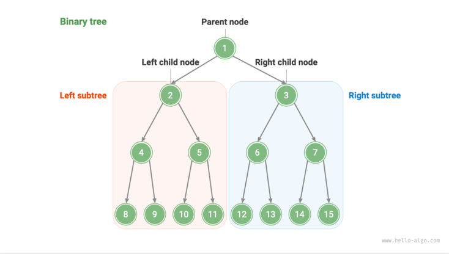
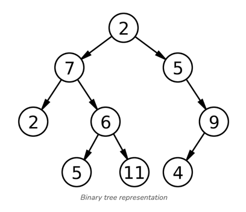
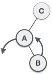
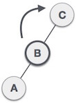
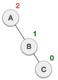
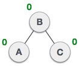
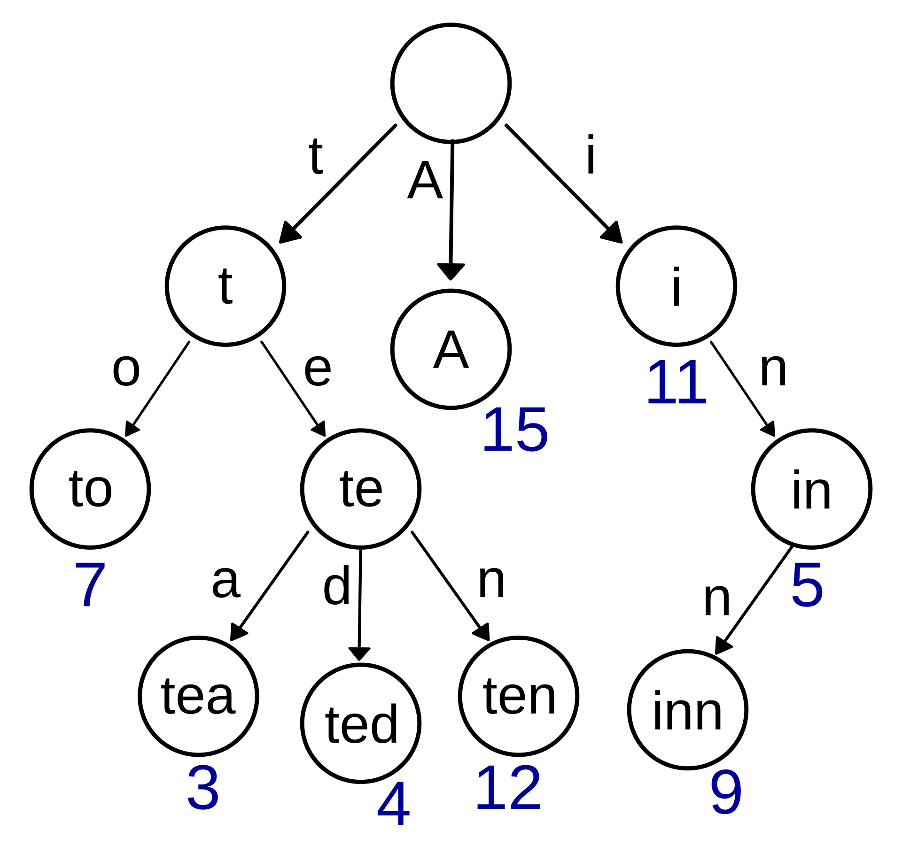

[트리](#트리)

- [용어](#용어)
- [특성](#특성)

- [일반 트리](#일반-트리-general-tree)
- [이진 트리](#이진-트리-binary-tree)
    - [포화 이진 트리](#포화-이진-트리-perfect-binary-tree)
    - [완전 이진 트리](#완전-이진-트리-complete-binary-tree)
    - [균형 이진 트리](#균형-이진-트리-balanced-binary-tree)
    - [이상적인 이진 트리와 피해야 할 이진 트리](#이상적인-이진-트리와-피해야-할-이진-트리)
    - [순회](#순회)
        - [레벨 순회](#레벨-순회-level-order)
        - [전위 순회](#전위-순회-pre-order)
        - [중위 순회](#중위-순회-in-order)
        - [후위 순회](#후위-순회-post-order)
- [이진 탐색 트리](#이진-탐색-트리-binary-search-tree-bst)
- [AVL 트리](#avl-트리-adelson-velsky-and-landis-tree-avl-tree)
- [Red-Black 트리](#red-black-트리)
- [세그먼트 트리](#세그먼트-트리-segment-tree)
- [팬윅 트리](#팬윅-트리-fenwick-tree-binary-indexed-tree)
- [힙](#힙-heap)
- [트라이](#트라이-trie)

## 트리

[](https://xlinux.nist.gov/dads/HTML/tree.html)

트리는 데이터를 **계층적 구조**로 표현하는 비선형 자료구조임

맨 위의 루트 노드를 시작으로 트리에 접근할 수 있는데, 루트 노드를 제외한 0개 이상의 노드들은 리프 노드이거나 내부 노드로 나뉨

### 용어

**노드 (node)**

- 트리의 기본 구성 요소
- 연결 리스트와 비슷하게 데이터를 포함하며 다른 노드를 가르키는 참조(포인터)를 가짐

**루트 노드 (root)**

- 트리의 시작점

**내부 노드(부모 노드) (internal, parent)**

- 한 개 이상의 자식을 가지는 부모 노드
- 루트 노드와 리프 노드를 제외한 나머지 노드

**자식 노드 (child)**

- 부모를 가진 노드
- 같은 노드의 자식은 모두 형제 노드임

**리프 노드 (leaf)**

- 해당 간선의 끝 노드

**서브 트리 (sub tree)**

- 트리를 이루는 작은 트리
- 각 노드는 자신을 루트로 하는 서브 트리를 가질 수 있음

**레벨 (level)**

- 같은 깊이를 가진 노드들의 집합 (해당 노드가 위치한 층 전체)
- 레벨0: 루트 노드
- 레벨1: 루트 노드의 모든 자식 노드들
- 레벨2: 레벨1의 모든 자식 노드들

**높이 (height)**

- 혀냊 노드에서 리프 노드까지의 간선 수

**깊이 (depth)**

- 루트 노드에서 특정 노드까지의 간선 개수 (개별 노드 위치)
- 루트 노드의 깊이: 0
- 루트 노드의 자식 노드의 깊이: 1
- 루트 노드에서 두 번째 자식 노드까지의 깊이: 2

**차수 (degree)**

- 노드의 차수: 해당 노드가 가진 자식의 수
- 트리의 차수: 가장 높은 차수를 가진 노드의 차수

**경로**

- 한 노드에서 다른 노드까지의 노드 및 간선의 집합
- 경로의 길이는 노드 간의 간선 수로 정의됨

### 특성

트리는 파일 시스템, 조직도 등 같이 계층적인 관계를 표현하기 적합함

연결 리스트와 같은 선형적인 자료구조와 달리, 여러 개의 경로를 따라 데이터를 검색하고 저장할 수 있는 비선형 자료구조임

여러 방식으로 순회할 수 있음

- 전위 순회(preorder)
- 중위 순회(inorder)
- 후위 순회(postorder)
- 레벨 순회(level order)

트리는 방향성과 사이클이 없는 그래프(undirected, acyclic)의 일종임

노드 간의 연결(간선)이 있음(connected)

일반적으로 루트가 있고, 정렬되어 있음

## 일반 트리 (General Tree)

노드가 가질 수 있는 자식 노드의 수에 제한이 없는 트리

트리의 구조가 일정한 규칙에 의해 제한되지 않음

조직 구도나 파일 시스템 같은 계층적 구조를 표현할 때 사용

## 이진 트리 (Binary Tree)

[](https://www.hello-algo.com/en/chapter_tree/binary_tree/)

각 노드가 최소 0개에서 최대 2개의 자식 노드를 가질 수 있는 트리

자식 노드는 왼쪽 노드과 오른쪽 노드로 구분되며, 왼쪽 자식 노드가 형성한 트리를 왼쪽 서브 트리, 오른쪽 자식 노드가 형성한 트리를 오른쪽 서브 트리라고 함

위의 1번 루트 노드의 왼쪽 서브 트리는 2번 노드를 기점으로 한 서브 트리이고, 오른쪽 서브 트리는 3번 노드임

#### TreeNode

이진 트리를 나타내는 클래스

내부 필드로 데이터와 left, right 자식 노드에 대한 참조값을 가짐

```python
class TreeNode:
    def __init__(self, val):
        self.val = val
        self.left: TreeNode | None = None
        self.right: TreeNode | None = None


# initialization
root = TreeNode(val=1)
n2 = TreeNode(val=2)
n3 = TreeNode(val=3)
n4 = TreeNode(val=4)
n5 = TreeNode(val=5)

root.left = n2
root.right = n3

n2.left = n4
n2.right = n5
```

#### 삽입

새로운 노드를 만들고, 포인터를 수정하여 새 노드를 삽입함

```python
# inserting
new = TreeNode(val=0)

root.left = new
new.left = n2
```

#### 삭제

자식 노드의 참조값을 다른 노드로 교체하여 삭제할 수 있음

```python
# removing
root.left = n2
```

### 포화 이진 트리 (Perfect Binary Tree)

[](https://medium.com/towards-data-science/5-types-of-binary-tree-with-cool-illustrations-9b335c430254)

포화 이진 트리(왼쪽)

모든 내부 노드가 자식 노드를 가지며, 모든 리프 노드가 동일한 깊이 또는 레벨을 가지는 이진 트리

### 완전 이진 트리 (Complete Binary Tree)

[](https://medium.com/towards-data-science/5-types-of-binary-tree-with-cool-illustrations-9b335c430254)

완전 이진 트리(왼쪽)

마지막 레벨을 제외하고 모든 레벨이 완전히 채워져 있으며, 마지막 레벨의 모든 노드는 가능한 왼쪽부터 채워지는 이진 트리

마지막 레벨 h에서 1부터 2^h - 1개까지의 리프 노드를 가질 수 있음

### 이상적인 이진 트리와 피해야 할 이진 트리


가장 좋은 이진 트리의 형태는 "분할 정복"을 최대한 이용할 수 있는 포화 이진 트리임

가장 안좋은 이진 트리의 형태는 모든 노드가 한 쪽으로 치우쳐 있어서 마치 연결 리스트처럼 순차적으로 저장되어 있는 형태로, 연산의 시간복잡도가 `O(n)`으로 저하됨

### 순회

트리는 연결 리스트를 기반으로 구현되는 자료구조로, 포인터를 통해 노드에 하나씩 접근하는 방식으로 트리를 탐색함

다만 비선형 자료구조이기 때문에, 연결 리스트보다 다양한 방식으로 순회를 돌 수 있음

일반적으로 전위 순회(pre-order), 중위 순회(in-order), 후위 순회(post-order), 레벨 순회(level-order) 방식이 있음

#### 레벨 순회 (level-order)

[](https://www.hello-algo.com/en/chapter_tree/binary_tree_traversal/#721-level-order-traversal)

트리의 위에서 아래로, 한 레벨을 모두 순회(왼쪽 -> 오른쪽 순)한 후 다음 레벨을 방문하는 방식임

레벨 순회는 **폭 우선 탐색(Breadth-First Search, BFS)** 방식으로, 그래프나 트리에서 시작 노드로부터 점점 넓게 탐색함

레벨 순회는 각 레벨을 차례대로 탐색하므로 BFS와 일치함

```python
def level_order_bfs(root: TreeNode | None) -> list[any]:
    queue: deque[TreeNode] = deque()
    queue.append(root)

    res = []
    while queue:
        node: TreeNode = queue.popleft()
        res.append(node.val)
        if node.left is not None:
            queue.append(node.left)
        if node.right is not None:
            queue.append(node.right)
    return res
```

루트 노드부터 다음 레벨의 노드들을 순차적으로 큐나 연결 리스트 담아서 순회를 돌 수 있음

모든 노드를 방문하므로 노드의 수만큼인 `O(n)`의 시간 복잡도를 가짐

#### 전위 순회 (pre-order)

전위, 중위, 후위 순회 방식은 가능한 한 깊이 내려가면서 탐색하는 방식으로, 트리의 각 노드를 특정 순서에 따라 방문함

깊이 우선 탐색(Depth-First Search, DFS)은 특정 경로를 완전히 탐색하기 전에 다른 경로로 가지 않으며, 스택(재귀)을 사용하여 방문한 노드를 추적함

전위/중위/후위는 DFS 방식으로, 트리의 각 노드를 깊이 우선 탐색하며 `O(n)`의 시간 복잡도를 가짐

전위 순회는 루트 -> 왼쪽 -> 오른쪽 순으로 노드를 방문함

- 현재 노드 방문
- 왼쪽 서브트리 전위 순회
- 오른쪽 서브트리 전위 순회
- ```python
  def pre_order(root: TreeNode | None, traversal: list[TreeNode]):
    if root is None:
        return

    traversal.append(root.val)
    pre_order(root.left, traversal)
    pre_order(root.right, traversal)
  ```

#### 중위 순회 (in-order)

중위 순회는 왼쪽 -> 루트 -> 오른쪽 순으로 노드를 방문함

이진 검색 트리에서 중위 순회를 사용하면 오름차순으로 정렬된 값을 얻을 수 있음

- 왼쪽 서브트리 중위 순회
- 현재 노드 방문
- 오른쪽 서브트리 중위 순회
- ```python
  def in_order(root: TreeNode | None, traversal: list[TreeNode]):
    if root is None:
        return

    in_order(root.left, traversal)
    traversal.append(root.val)
    in_order(root.right, traversal)
  ```

#### 후위 순회 (post-order)

후위 순회는 왼쪽 -> 오른쪽 -> 루트 순으로 노드를 방문함

모든 자식 노드들을 먼저 방문한 후 부모 노드를 방문함

파일 시스템 탐색이나 구문 트리 등의 구조에서 자주 사용됨

- 왼쪽 서브트리 후위 순회
- 오른쪽 서브트리 후위 순회
- 현재 노드 방문
- ```python
  def post_order(root: TreeNode | None, traversal: list[TreeNode]):
    if root is None:
        return

    post_order(root.left, traversal)
    post_order(root.right, traversal)
    traversal.append(root.val)
  ```

## 이진 탐색 트리 (Binary Search Tree, BST)

[](https://www.geeksforgeeks.org/properties-of-binary-tree/)

이진 트리의 한 종류로, 각 노드의 왼쪽 서브 트리는 보다 작은 값을 가지고, 오른쪽 서브트리는 보다 큰 값을 가짐

효율적인 검색과 정렬된 데이터를 유지할 수 있음

[구현 코드(자바)](./java/src.main.java.BinarySearchTree.java)

## 균형 이진 트리 (Balanced Binary Tree)

[](https://medium.com/towards-data-science/5-types-of-binary-tree-with-cool-illustrations-9b335c430254)

자가 균형 이진 트리(왼쪽)

모든 노드의 왼쪽 서브트리와 오른쪽 서브트리의 높이 차이가 최대 1 이진 트리

자주 사용되는 균형 이진 트리의 종류로 AVL 트리와 Red-Black 트리가 있음

효율적인 데이터 삽입/삭제를 할 수 있음

## AVL 트리 (Adelson-Velsky and Landis Tree, AVL Tree)

[](https://en.wikipedia.org/wiki/AVL_tree)

자가 균형 이진 탐색 트리의 일종으로 AVL 트리는 각 노드의 왼쪽/오른쪽 서브 트리의 높이 차이가 최대 1(-1, 0, 1)이 되도록 유지함 - Balance Factor

삽입과 삭제 시 트리의 균형이 깨지면 그 즉시 회전(Rotation) 연산(단일 회전 또는 이중 회전)을 수행하여 트리의 균형을 바로 잡음

균형을 매우 엄격하게 유지하기 때문에 삽입과 삭제 시 리밸런싱이 자주 일어나며, 리밸런싱에 드는 오버헤드가 레드-블랙 트리보다 큼

자주 변경되는 데이터베이스 인덱스를 관리하거나 높은 삽입과 삭제 빈도를 가진 검색 엔진에서 검색 속도를 최적화하기 위해 사용됨

탐색/삽입/삭제 시간 복잡도: `O(log n)`

### AVL 트리 회전 연산

불균형된 트리 구조에 따라 LL, RR, LR, RR 회전 연산을 수행함  

[회전 연산 이미지 출처](https://www.javatpoint.com/avl-tree)

#### LL 회전


트리가 왼쪽으로 치우쳐져 있을 때(left-skewed, Balance Factor >=2) LL(Left-Left) 회전 연산을 사용함

LL 연산은 시계 방향으로 회전하여 노드의 균형을 맞춤

#### RR 회전


LL 회전과 반대로, 오른쪽으로 치우쳐져 있을 때 (right-skewed, Balance Factor >=2) RR 회전 연산을 사용함

RR 연산은 반시계 방향으로 회전하여 노드의 균형을 맞춤

#### LR 회전


B 노드 삽입으로 인해 C 노드는 BF 값이 2인 불균형 상태인 서브 트리를 가짐 

A 노드는 C의 왼쪽 서브 트리에 해당하고, B 노드는 A의 오른쪽 서브 트리에 해당함

위와 같은 구조처럼 왼쪽 서브 트리와 그 하위 오른쪽 서브 트리로 인해 불균형 상태를 이룰 때 LR 회전 연산을 사용함

LR 연산은 RR 회전 후 LL 회전 연산(총 2회)을 수행함 




불균형 서브 트리의 루트(A 노드)를 기준으로 첫 번째 회전 연산인 RR 회전 연산을 수행함

그러면 A 노드는 B 노드의 왼쪽 서브 트리에 위치하게 됨

RR 회전 연산을 수행해도 아직까진 불균형 상태를 이루고 있음



두 번째 회전 연산인 LL 연산은 불균형 트리를 가지고 있는 서브 트리를 대상으로 수행함


위와 같이 C 노드는 B 노드의 오른쪽 서브 트리가 되고, A 노드는 B 노드의 왼쪽 서브트리에 위치하게 되어 균형 상태를 되찾음

#### RL 회전


LR 회전 연산과 반대로, 오른쪽 서브트리와 그 하위의 왼쪽 서브트리로 인해 불균형 상태를 이룰 때 RL 회전 연산을 사용함

RL 회전 연산은 LL 연산, RR 연산을 순차적으로 수행함




먼저 불균형 서브 트리의 루트 노드인 C 노드를 기준으로 LL 연산을 수행함

LL 회전 연산을 수행해도 아직까진 불균형 상태를 이루고 있음


두 번째 회전 연산인 RR 연산은 불균형 트리를 가지고 있는 서브 트리를 대상으로 수행함



위와 같이 C 노드는 B 노드의 오른쪽 서브 트리가 되고, A 노드는 B 노드의 왼쪽 서브트리에 위치하게 되어 균형 상태를 되찾음

## Red-Black 트리

[](https://en.wikipedia.org/wiki/Red%E2%80%93black_tree)

또 다른 자가 균형 이진 탐색 트리의 일종으로, 노드는 빨간색 또는 검은색으로 칠하며 트리의 균형을 유지하기 위한 일종의 규칙을 따름

레드-블랙 트리 규칙
- 루트 노드: 항상 검정
- 빨강 노드의 자식: 반드시 검정
- 루트에서 리프까지의 경로에 놓인 검정 노드의 수: 모두 같아야 함

AVL 트리보다 느슨한 균형 조건을 가지기 때문에 완벽한 높이 균형을 맞추지 않지만 최악의 경우에도 균형이 무너지지 않으며 리밸런싱 오버헤드가 적음

탐색/삽입/삭제 시간 복잡도: `O(log n)`

맵이나 셋 자료구조를 구현하는 데 사용됨 (자바의 TreeMap, TreeSet 등)

## B-Tree, B+Tree

디스크 기반 저장 시스템에서 디스크 I/O를 최소화하기 위해 설계된 트리 자료구조

데이터베이스 인덱스와 파일 시스템의 구조에 자주 사용됨

## 세그먼트 트리 (Segment Tree)

배열과 같은 연속된 데이터의 특정 구간에 대해 빠른 검색과 업데이트를 가능하게 하는 트리

구간 합, 구간의 최솟값과 최댓값을 빠르게 구해야 되거나, 범위 검색과 업데이트를 동시에 최적화할 때 사용됨

## 팬윅 트리 (Fenwick Tree, Binary Indexed Tree)

세그먼트 트리보다 메모리 사용량이 적고 구현이 간단한 자료구조로, 배열의 누적 합 계산 및 업데이트를 빠르게 수행하는 트리

## 힙 (Heap)

완전 이진 트리의 일종으로 최대 힙과 최소 힙으로 구분됨

최대 힙: 부모 노드의 값이 자식 노드의 값보다 크거나 같음

최소 힙: 부모 노드의 값이 자식 노드의 값보다 작거나 같음

우선순위 큐나 힙 구조를 이용한 정렬 알고리즘을 구현할 수 있음

## 트라이 (Trie)

[](https://en.wikipedia.org/wiki/Trie)

문자열을 저장하고 효율적으로 검색하기 위한 트리 구조

각 노드는 문자열의 한 문자를 나타내며, 루트 노드에서 리프 노드까지의 한 경로가 문자열을 나타냄

단어 검색이나 네트워크 라우터에서 IP 주소를 빠르게 검색하고 결정할 때 사용됨